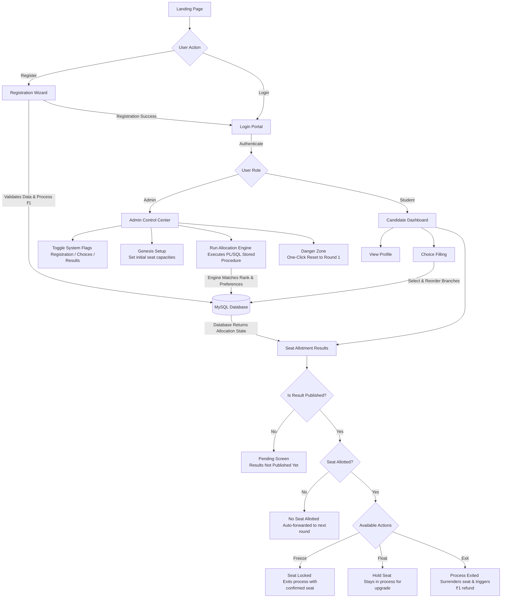

# VARAN Seat Allocation System

**VARAN** is a modern, full-stack university seat allocation engine designed with a sleek, dark-themed "Antigravity" aesthetic. It manages the entire admissions lifecycle—from student registration and choice filling to merit-based, multi-round seat allotment.

## 🚀 Key Features

### 🎓 For Candidates
- **Landing Page:** Beautifully animated glassmorphism UI showing real-time branch capacities.
- **Strict Registration:** Multi-step wizard enforcing strict data validation (roll number, email, phone, secure passwords) and a simulated ₹1 registration payment.
- **Interactive Dashboard:** Candidates can freely add, reorder, and remove engineering branch preferences.
- **Round-Based Results:** Once results are published, candidates can take action:
  - **Freeze:** Lock the seat and exit the allocation process.
  - **Float:** Hold the seat but wait for a potential upgrade in the next round.
  - **Exit:** Surrender the seat, trigger an automatic refund of the ₹1, and exit the process.

### 🛡️ For Administrators
- **Control Center:** A dedicated `/admin.html` portal.
- **System Flags:** Toggle Registration, Choice Filling, and Result Publishing on the fly.
- **Genesis Setup:** Define total capacities for each branch before Round 1 begins.
- **One-Click Engine:** Triggers a heavy PL/SQL stored procedure inside the MySQL database to instantly calculate merit-based allocations for the current round.
- **Danger Zone:** A one-click automated feature that reads `reset_demo.sql` to instantly wipe all data and revert the system to a clean Round 1 state.

---

## 🏗️ System Workflow

The following diagram maps out the complete end-to-end architecture and user journey of the VARAN platform:



---

## 💻 Tech Stack
- **Frontend:** HTML5, Tailwind CSS (JIT compiled), Vanilla JavaScript
- **Backend:** Node.js, Express.js, `mysql2`
- **Database:** MySQL 8.0+

---

## 📂 Project Structure
```text
VARAN/
├── backend/
│   ├── server.js          # Core Express API routing and DB connections
│   ├── package.json
│   └── .env.example       # Example environment variables
├── frontend/
│   ├── index.html         # Landing page
│   ├── register.html      # Multi-step registration wizard
│   ├── login.html         # Authentication portal
│   ├── dashboard.html     # Candidate dashboard
│   ├── admin.html         # Admin control center
│   └── tailwind.css       # Compiled Tailwind styles
└── sql/
    ├── schema.sql         # Base database schema
    ├── procedures.sql     # PL/SQL algorithm for seat allocation
    └── reset_demo.sql     # Automated script to reset demo
```

---

## ⚙️ Setup Instructions

### 1. Database Setup
Ensure MySQL is running, then execute the schema and procedures:
```bash
mysql -u root -p < sql/schema.sql
mysql -u root -p < sql/procedures.sql
```

### 2. Backend Setup
Install Node dependencies and configure your environment:
```bash
cd backend
npm install
cp .env.example .env
# Edit .env and enter your MySQL credentials
node server.js
```

### 3. Frontend Compilation (Optional)
If you modify the HTML and need to rebuild the Tailwind CSS classes:
```bash
npx tailwindcss -i input.css -o frontend/tailwind.css --watch
```

### 4. Launch
Open `frontend/index.html` in your browser. Use the default admin credentials (`admin` / `admin`) to configure Round 1 capacities.
