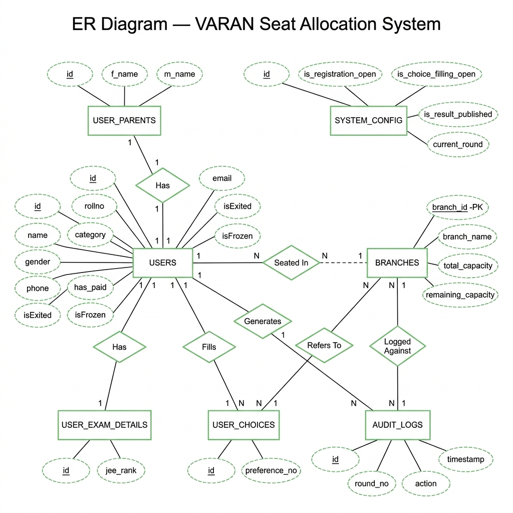

# VARAN — ER Diagram (Chen Notation)

> Entity-Relationship Diagram for the `seat_allocation_v2_db` database using classic Chen notation (rectangles for entities, diamonds for relationships, ovals for attributes).

---

## Entities & Relationships

| Entity | Relationship | Entity | Cardinality |
|---|---|---|---|
| USERS | Has | USER_PARENTS | 1 : 1 |
| USERS | Has | USER_EXAM_DETAILS | 1 : 1 |
| USERS | Fills | USER_CHOICES | 1 : N |
| USER_CHOICES | Refers To | BRANCHES | N : 1 |
| USERS | Seated In | BRANCHES | N : 1 (optional) |
| USERS | Generates | AUDIT_LOGS | 1 : N |
| AUDIT_LOGS | Logged Against | BRANCHES | N : 1 |
| SYSTEM_CONFIG | — | (Standalone) | — |

---

## Tables Overview

| Table | Description |
|---|---|
| `system_config` | Global app state — controls registration, choice filling, round number, result publishing |
| `branches` | Available engineering branches with total and remaining seat capacities |
| `users` | Core student entity with login credentials, personal details, and seat status |
| `user_parents` | Parental info linked to each user (1-to-1) |
| `user_exam_details` | JEE Main rank linked to each user (1-to-1) |
| `user_choices` | Branch preferences submitted by each user (1-to-many, ordered by preference_no) |
| `audit_logs` | Full audit trail of every allocation action (Allocated, Upgraded, Frozen, Floated, Exited) |
